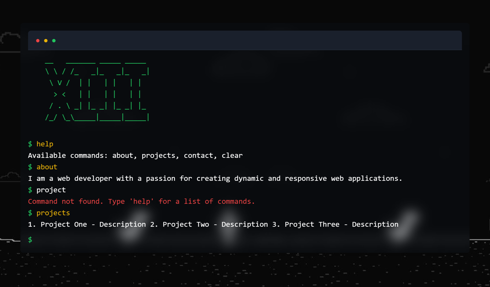

# Terminal Portfolio

This is a unique and interactive portfolio website styled as a terminal. The user can input commands to learn more about you, your projects, and how to contact you. The site is built using HTML, Tailwind CSS, and JavaScript.



## Features

- **Terminal-style Interface**: An engaging and retro way to present your portfolio.
- **Interactive Commands**: Users can type commands like `about`, `projects`, `contact`, and `help` to navigate through your portfolio.
- **ASCII Art**: Cool ASCII art displayed at the top of the terminal.
- **Customizable**: Easily add more commands and customize the content.

## Getting Started

These instructions will get you a copy of the project up and running on your local machine for development and testing purposes.

### Prerequisites

- Node.js
- npm (Node Package Manager)

### Installation

1. Clone the repository:

    ```bash
    git clone https://github.com/your-username/terminal-portfolio.git
    cd terminal-portfolio
    ```

2. Install the dependencies:

    ```bash
    npm install
    ```

3. Build the Tailwind CSS:

    ```bash
    npx tailwindcss -i ./src/tailwind.css -o ./dist/output.css --watch
    ```

4. Open `index.html` in your browser to view the website.

## Usage

- Type `help` to see the list of available commands.
- Commands:
  - `about` - Learn more about me.
  - `projects` - See my projects.
  - `contact` - Get my contact information.
  - `clear` - Clear the terminal screen.

## Customization

### Adding New Commands

1. Open `app.js`.
2. In the `commands` object, add your new command and its corresponding output:

    ```javascript
    const commands = {
      help: 'Available commands: about, projects, contact, clear, newcommand',
      about: 'I am a web developer with a passion for creating dynamic and responsive web applications.',
      projects: '1. Project One - Description\n2. Project Two - Description\n3. Project Three - Description',
      contact: 'Email: example@example.com\nLinkedIn: linkedin.com/in/example',
      clear: '',
      newcommand: 'This is a new command you added!'
    };
    ```

3. Save the file and refresh `index.html` in your browser.

### Changing the ASCII Art

1. Open `index.html`.
2. Modify the `<pre>` tag content inside the `#asciiArt` div with your desired ASCII art.

## Built With

- [Tailwind CSS](https://tailwindcss.com/) - A utility-first CSS framework for rapid UI development.
- HTML
- JavaScript

## Contributing

Feel free to submit issues and enhancement requests.

## Authors

- **Rhouch Bilall**


## Acknowledgments

- Inspiration from classic terminal UIs.
- ASCII Art generated from [ASCII Art Generator](https://www.ascii-art.de/).

